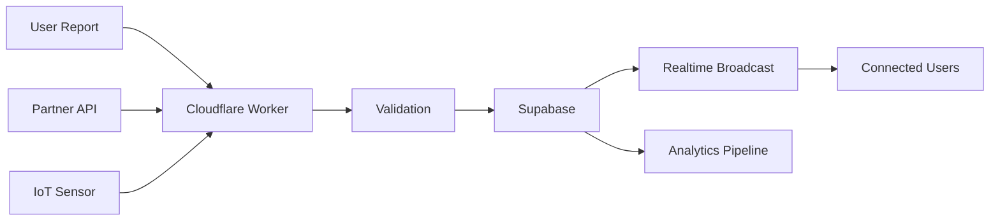

# Data Models

## Overview

This document defines the data architecture and models for QNom, Singapore's zero-cost F&B discovery platform. Our data model is optimized for real-time queue tracking, personalized recommendations, and scalable partner management.

## Entity Relationship Diagram

```
[User] ----< [UserProfile]
  |
  |----< [Favorites]
  |
  |----< [Reviews]
  |
  |----< [QueueReports]
  
[Restaurant] ----< [QueueStatus]
  |
  |----< [MenuItem]
  |
  |----< [OpeningHours]
  |
  |----< [Reviews]
  |
  |----< [Analytics]

[Queue] >---- [QueueUpdate] 
  |
  |----< [QueuePrediction]
  
[Partner] ----< [Restaurant]
  |
  |----< [Subscription]
  |
  |----< [PaymentHistory]
```

## Core Entities

### User

```typescript
interface User {
  id: string; // UUID
  email: string;
  phone?: string; // Optional for social login
  authProvider: 'email' | 'google' | 'facebook';
  emailVerified: boolean;
  status: 'active' | 'suspended' | 'deleted';
  createdAt: Date;
  updatedAt: Date;
  lastActiveAt: Date;
  preferences: {
    dietary: string[]; // ['halal', 'vegetarian', 'vegan']
    cuisines: string[]; // ['chinese', 'malay', 'indian']
    priceRange: [number, number]; // [5, 25]
    notifications: boolean;
  };
}
```

**Indexes:**
- Primary: id
- Unique: email
- Index: status, lastActiveAt
- Index: authProvider

**Relationships:**
- Has one UserProfile
- Has many Favorites
- Has many Reviews
- Has many QueueReports

### Restaurant

```typescript
interface Restaurant {
  id: string; // UUID
  partnerId?: string; // UUID, null for unclaimed
  name: string;
  description: string;
  type: 'hawker' | 'restaurant' | 'cafe' | 'bar';
  cuisineTypes: string[];
  priceRange: {
    min: number;
    max: number;
    currency: 'SGD';
  };
  location: {
    address: string;
    postalCode: string;
    latitude: number;
    longitude: number;
    area: string; // 'CBD', 'Orchard', etc.
    nearestMRT?: string;
  };
  contact: {
    phone?: string;
    whatsapp?: string;
    website?: string;
  };
  features: string[]; // ['halal', 'air-con', 'wifi', 'parking']
  images: {
    logo?: string;
    cover?: string;
    gallery: string[];
  };
  verified: boolean;
  status: 'active' | 'inactive' | 'suspended';
  metrics: {
    avgRating: number;
    totalReviews: number;
    avgQueueTime: number; // in minutes
    popularTimes: Record<string, number[]>; // day -> hourly crowd levels
  };
  createdAt: Date;
  updatedAt: Date;
}
```

**Indexes:**
- Primary: id
- Foreign Key: partnerId
- Index: status, verified
- Geo Index: location.latitude, location.longitude
- Full-text: name, description
- Index: cuisineTypes (GIN)
- Index: features (GIN)

### QueueStatus

```typescript
interface QueueStatus {
  id: string; // UUID
  restaurantId: string; // UUID
  currentWaitTime: number; // minutes
  queueLength: number; // number of people/groups
  status: 'low' | 'moderate' | 'high' | 'closed';
  lastUpdated: Date;
  source: 'crowdsourced' | 'partner' | 'sensor' | 'predicted';
  confidence: number; // 0-1 confidence score
  historicalData: {
    hourlyAverage: number[];
    dailyPattern: Record<string, number[]>;
  };
}
```

**Indexes:**
- Primary: id
- Foreign Key: restaurantId
- Index: lastUpdated, status
- Index: restaurantId, lastUpdated

### QueueUpdate

```typescript
interface QueueUpdate {
  id: string; // UUID
  restaurantId: string; // UUID
  userId?: string; // UUID, if crowdsourced
  waitTime: number; // reported wait time in minutes
  queueLength?: number;
  timestamp: Date;
  source: 'user' | 'partner' | 'sensor';
  verificationStatus: 'pending' | 'verified' | 'rejected';
  metadata: {
    deviceId?: string;
    accuracy?: number;
    photos?: string[];
  };
}
```

**Indexes:**
- Primary: id
- Foreign Key: restaurantId, userId
- Index: restaurantId, timestamp
- Index: source, verificationStatus

### Partner

```typescript
interface Partner {
  id: string; // UUID
  businessName: string;
  uen: string; // Unique Entity Number
  type: 'individual' | 'company';
  subscription: {
    tier: 'free' | 'premium' | 'enterprise';
    status: 'active' | 'trial' | 'expired';
    startDate: Date;
    endDate?: Date;
    features: string[];
  };
  billing: {
    email: string;
    phone: string;
    address: string;
    paymentMethod?: 'card' | 'paynow' | 'invoice';
  };
  apiKeys: {
    live: string;
    test: string;
  };
  settings: {
    autoUpdateQueue: boolean;
    notifications: boolean;
    analyticsFrequency: 'daily' | 'weekly' | 'monthly';
  };
  createdAt: Date;
  updatedAt: Date;
}
```

**Indexes:**
- Primary: id
- Unique: uen
- Index: subscription.status, subscription.tier

## Data Access Patterns

### Read Patterns

1. **Restaurant Discovery**
   - Query: Find restaurants by location, cuisine, features
   - Frequency: Very High
   - Cache: Edge cache (5 minutes)
   - Optimization: Spatial index, materialized views

2. **Real-time Queue Status**
   - Query: Get current queue for restaurant
   - Frequency: Extreme (every 30 seconds during peak)
   - Cache: KV store (30 seconds)
   - Optimization: Denormalized current status

3. **Personalized Recommendations**
   - Query: Get recommendations based on user preferences
   - Frequency: High
   - Cache: User-specific cache (10 minutes)
   - Optimization: Pre-computed recommendation scores

### Write Patterns

1. **Queue Updates**
   - Operations: Insert queue update, update current status
   - Frequency: High (1000s per minute during peak)
   - Real-time: Broadcast via WebSocket
   - Validation: Rate limiting, anomaly detection

2. **User Reviews**
   - Operations: Insert review, update restaurant metrics
   - Transaction: Required
   - Validation: One review per user per restaurant

3. **Partner Data Sync**
   - Operations: Bulk update menu, hours, status
   - Frequency: Daily batches
   - Optimization: Bulk insert with conflict resolution

## Data Validation Rules

### User Data
- Email: Valid format, unique, lowercase
- Phone: Singapore format (+65 XXXX XXXX)
- Dietary preferences: Validated against enum
- Location permissions: Required for recommendations

### Restaurant Data
- Name: 2-100 characters, unique per location
- Postal code: Valid Singapore postal code
- Coordinates: Within Singapore boundaries
- Price range: Min $1, Max $500
- Images: Max 5MB, JPEG/PNG/WebP only

### Queue Data
- Wait time: 0-180 minutes
- Queue length: 0-999 people
- Update frequency: Max 1 per user per restaurant per 5 minutes
- Anomaly detection: Flag suspicious patterns

## Data Migration Strategy

### Zero-Downtime Migrations
- Use Supabase migrations with version control
- Blue-green deployment for schema changes
- Progressive rollout with feature flags

### Migration Process
1. Development: Automatic via Supabase CLI
2. Staging: GitHub Actions on merge to staging
3. Production: Manual approval with automated execution

### Data Seeding
- Initial restaurant data from government databases
- Synthetic queue data for testing
- Partner onboarding templates

## Data Privacy and Compliance

### PDPA Compliance (Singapore)
- Explicit consent for data collection
- Purpose limitation for data use
- Notification of data breaches within 72 hours
- Data Protection Officer appointed

### Data Security
- PII encryption using AES-256
- Row-level security in PostgreSQL
- API access logging and monitoring
- Regular security audits

### Data Retention
- User profiles: Until account deletion + 30 days
- Queue history: 90 days for analytics
- Reviews: Permanent (anonymized after account deletion)
- Partner data: 7 years for compliance

## Performance Optimization

### Indexing Strategy
- Spatial indexes for location queries (PostGIS)
- GIN indexes for array fields (cuisines, features)
- B-tree for timestamp-based queries
- Partial indexes for active records only

### Caching Strategy
```typescript
// Cache layers and TTLs
const cacheConfig = {
  edge: {
    restaurantList: 300, // 5 minutes
    queueStatus: 30,    // 30 seconds
    userProfile: 600    // 10 minutes
  },
  database: {
    popularRestaurants: 3600, // 1 hour
    areaAggregates: 1800      // 30 minutes
  }
};
```

### Query Optimization
- Materialized views for restaurant listings
- Pre-aggregated analytics data
- Connection pooling with pgBouncer
- Read replicas for analytics queries

## Real-time Data Flow

### Queue Update Flow


### WebSocket Events
```typescript
// Real-time event types
type RealtimeEvent = 
  | { type: 'queue_update'; restaurantId: string; data: QueueStatus }
  | { type: 'restaurant_status'; restaurantId: string; status: 'open' | 'closed' }
  | { type: 'flash_deal'; restaurantId: string; deal: FlashDeal };
```

## Backup and Recovery

### Automated Backups
- Supabase automated backups (daily)
- Point-in-time recovery (7 days)
- Cross-region backup replication

### Disaster Recovery
- RPO: 5 minutes (via WAL streaming)
- RTO: 15 minutes (automated failover)
- Monthly DR drills
- Backup verification scripts

## Future Considerations

1. **Advanced Analytics**
   - Time-series database for queue predictions
   - Graph database for recommendation engine
   - Data lake for ML model training

2. **Regional Expansion**
   - Multi-tenant architecture
   - Country-specific data residency
   - Localized compliance requirements

3. **IoT Integration**
   - Queue sensor data ingestion
   - Real-time stream processing
   - Edge computing for sensor networks

## Data Model Governance

### Schema Evolution
- Backward compatible changes only
- Deprecation notices (90 days)
- Version APIs for breaking changes

### Documentation
- OpenAPI specs for all endpoints
- GraphQL schema for partner API
- Regular data dictionary updates